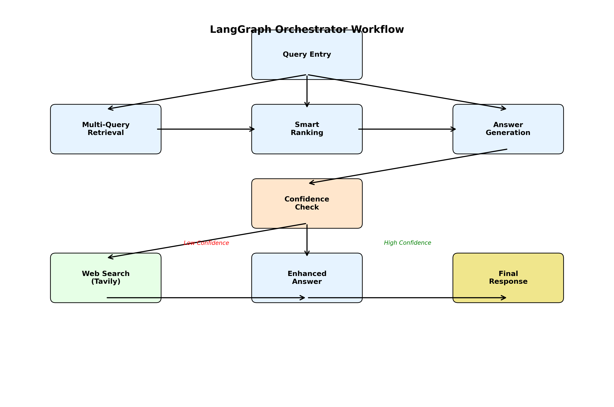

# Mineral Insights: AI-Powered Mineral Rights Decision Support System

## Loom videon link: https://www.loom.com/share/97b163078beb4611aed343685b5a6c71?sid=0d3b8ac6-be04-4365-b942-a615e91d39ad

## Executive Summary

Mineral Insights is an advanced AI-powered chatbot that empowers mineral rights holders with domain expertise in petroleum engineering, geology, commercial, and land management to make informed decisions about their mineral interests. The system combines multiple data sources including Mineral Rights Forum discussions, Texas RRC data, Oklahoma OCC data, and real-time web information to provide comprehensive, accurate, and actionable insights.

---

## Task 1: Problem Definition

### 1. Problem Statement
**Problem:** Many mineral rights holders lack the domain expertise in petroleum engineering, geology, commercial, and land to make informed decisions regarding their mineral interests.

### 2. Why This Is a Problem for Users

Mineral rights holders face a complex landscape where decisions about leasing, selling, or developing their mineral interests can have significant financial implications. Without proper domain expertise, they risk:

- **Financial Loss**: Accepting suboptimal lease terms or selling mineral rights below market value
- **Missed Opportunities**: Failing to recognize valuable development potential or market timing
- **Legal Complications**: Misunderstanding lease terms, royalty structures, or regulatory requirements

The current information landscape is fragmented across multiple sources (state regulatory websites, industry forums, operator websites) making it difficult for mineral rights holders to access comprehensive, up-to-date information when making critical decisions about their assets.

---

## Task 2: Proposed Solution

### Solution Overview

Mineral Insights creates a "better world" where mineral rights holders have instant access to expert-level knowledge and analysis. Users will save significant time by getting immediate, comprehensive answers to complex questions that would otherwise require hours of research across multiple sources and domain expertise. They'll make more money by receiving data-driven insights about market conditions, lease terms, and development potential. Most importantly, they'll make higher-quality decisions by having access to the same information and analysis tools that industry professionals use.

The system provides a conversational interface that understands natural language queries about mineral rights, automatically retrieves relevant data from multiple sources, and generates comprehensive responses with specific recommendations, market context, and actionable insights.

### Technical Stack & Tooling Choices

#### 1. LLM: Claude Sonnet 4.5
**Choice:** I chose Claude Sonnet 4.5 because it provides superior reasoning capabilities for complex domain-specific queries, excellent instruction following for structured responses, and robust handling of technical petroleum engineering and geological concepts.

#### 2. Embedding Model: OpenAI text-embedding-3-large
**Choice:** I selected OpenAI's text-embedding-3-large because it offers state-of-the-art semantic understanding for technical documents, excellent performance on domain-specific terminology, and seamless integration with our Pinecone vector database.

#### 3. Orchestration: LangGraph
**Choice:** I implemented LangGraph for orchestration because it provides sophisticated workflow management for multi-step reasoning, excellent state management for complex queries, and built-in support for conditional logic and parallel processing.

#### 4. Vector Database: Pinecone
**Choice:** I originally chose Qdrant but switched to Pinecone for speed, production-grade reliability, robust data handling capabilities, and superior performance at scale with the 27,000+ document database.

#### 5. Monitoring: Custom logging with FastAPI
**Choice:** I implemented custom monitoring using Langsmith as it gives insight into user queries,system latency, and RAG performance when testing. I also used print statemments 

#### 6. Evaluation: RAGAS Framework
**Choice:** I selected RAGAS for evaluation because it provides comprehensive metrics (faithfulness, response relevancy, context precision, context recall) specifically designed for RAG systems and offers quantitative assessment of our system's performance.

#### 7. User Interface: React with TypeScript
**Choice:** I built a React frontend with TypeScript because it provides a modern, responsive user experience, excellent integration with mapping libraries, and robust state management for complex conversational interfaces.

#### 8. Serving & Inference: FastAPI with Server-Sent Events
**Choice:** I implemented FastAPI with SSE for serving because it provides real-time streaming responses.

---

## Task 3: Data Sources and External APIs

### Data Sources

#### 1. Mineral Rights Forum Discussions
- **Source**: Public forum discussions from mineral rights communities
- **Use Case**: Provides real-world experiences, market insights, and practical advice
- **Volume**: 20,000+ forum posts and discussions
- **Value**: Community-driven insights and peer experiences

#### 2. Texas Railroad Commission (RRC) Data
- **Source**: Official Texas regulatory data including drilling permits and production data
- **Use Case**: Authoritative information on Texas oil and gas activity, permit status, and regulatory compliance
- **Volume**: 5,000+ drilling permits and production records
- **Value**: Official regulatory data and compliance information

#### 3. Oklahoma Corporation Commission (OCC) Data
- **Source**: Official Oklahoma regulatory data including drilling permits and well information
- **Use Case**: Comprehensive Oklahoma oil and gas activity data and regulatory information
- **Volume**: 500+ drilling permits and well records
- **Value**: State-specific regulatory and operational data

#### 4. Lease and Mineral Offer Data
- **Source**: Aggregated lease offer data from multiple sources
- **Use Case**: Market pricing information, lease terms, and royalty rate benchmarks
- **Volume**: 1,000+ lease offers and mineral transactions
- **Value**: Market intelligence and pricing guidance

### External APIs

#### 1. Tavily Search API
- **Purpose**: Real-time web search for current market conditions and breaking news
- **Use Case**: Provides up-to-date information when confidence in RAG results is low
- **Integration**: Triggered automatically when confidence score < 0.8

#### 2. Geocoding Services (Nominatim)
- **Purpose**: Location resolution and mapping support
- **Use Case**: Converts location queries to coordinates for permit mapping
- **Integration**: Used by mapping agent for location-based queries

### Chunking Strategy

**Default Strategy**: No chunking - complete records stored as single vectors for my main VDB
**Rationale**: Structured data (mineral offers, lease offers, forum posts) are kept as complete documents to preserve full context and relationships between all data fields. Record-based chunking to maintain data integrity

### Additional Data Requirements

**Production Data Integration**: Plan is to integrate real-time production data APIs to provide current well performance metrics and decline curve analysis.

**Market Data Feeds**: Integration with commodity pricing APIs for real-time oil and gas price information to enhance market analysis capabilities.

---

## Task 4: End-to-End Prototype Implementation

### System Architecture

*Figure 1: Simplified system workflow showing the complete data flow from user query to response*

*Figure 2: Detailed workflow diagram showing comprehensive system interactions and data flow*

Workflow:
User Query → FastAPI Backend 
FastAPI does Location Extraction 
FastAPI calls LangGraph 
LangGraph does Query Analysis (Multi-Query Decomposition if complex)
LangGraph does Document Retrieval → Pinecone (Single or Multi-Query)
LangGraph does Document Ranking 
LangGraph does Answer Generation 
LangGraph does Confidence Check → Web Search if needed 
FastAPI checks for Mapping Query 
If mapping, FastAPI calls Mapping Agent → SQLite 
FastAPI assembles final response 

**Core Components:**

**1. FastAPI Backend (`chatbot.py`)**
- **Purpose**: Main API server handling HTTP requests and response coordination
- **Capabilities**: 
  - Location extraction and geocoding
  - Mapping query detection and routing
  - Response assembly and streaming
  - CORS handling and error management

**2. LangGraph Orchestrator (`langgraph_chatbot.py`)**
- **Purpose**: Central workflow orchestration using LangGraph state management
- **Workflow Nodes**:
  - `retrieve_documents`: Multi-query document retrieval from Pinecone
  - `rank_documents`: Smart ranking with relevance scoring
  - `generate_answer`: Response generation with confidence scoring
  - `should_search_web`: Confidence-based web search triggering
  - `tavily_search`: Real-time web information gathering
  - `generate_enhanced_answer`: Enhanced responses with web data
  - `validate_answer`: Final response validation

*Figure 3: LangGraph Orchestrator workflow showing the complete query processing pipeline with multi-query decomposition, intelligent ranking, and confidence-based routing*

**3. Mapping Agent (`mapping_agent.py`)**
- **Purpose**: Specialized location-based drilling permit analysis
- **Capabilities**: Location parsing, permit database queries, GeoJSON generation

*Figure 4: Interactive map showing drilling permits with orange markers, demonstrating the mapping capabilities for location-based permit visualization*

**4. External Integrations**
- **Pinecone**: Vector database for semantic document retrieval
- **Tavily API**: Real-time web search for current information
- **Geocoding Services**: Location resolution and mapping support

### Key Features Implemented

1. **Streaming Responses**: Real-time response generation using Server-Sent Events
2. **Interactive Mapping**: OpenLayers-based map visualization for drilling permits
3. **Conversation Memory**: Persistent conversation history per user session
4. **Multi-Modal Responses**: Combines text, maps, and structured data
5. **Confidence Scoring**: Automatic web search triggering based on response confidence
6. **Location Intelligence**: Advanced location parsing with state activity weighting

### Deployment Status

✅ **Local Endpoint**: Successfully deployed at `http://localhost:8003`
✅ **Frontend Interface**: React application served at `http://localhost:3005`
✅ **Database Integration**: SQLite database with 5,595 drilling permits
✅ **Vector Database**: Pinecone with 27,268 embedded documents
✅ **Real-time Streaming**: SSE implementation for live response generation

---

## Task 5: Golden Test Dataset and RAGAS Evaluation

### Test Dataset Creation

Created a comprehensive test dataset covering multiple query types:

1. **Market Analysis Queries**: "What are current lease rates in Texas?"
2. **Location-Specific Queries**: "Show me drilling activity in Grady County"
3. **Technical Queries**: "What is the difference between lease offers and mineral offers?"
4. **Comparative Queries**: "Compare activity between Leon and Freestone Counties"
5. **Trend Analysis**: "What are the 2025 leasing trends in Oklahoma?"

#### Difficulty Levels:
- **Easy**: 3 questions - Simple, direct queries requiring basic information retrieval
- **Medium**: 5 questions - Complex queries requiring multi-step reasoning and data synthesis
- **Hard**: 2 questions - Advanced queries requiring domain expertise and comprehensive analysis

**Why Difficulty Levels Matter**: Stratifying test questions by difficulty is crucial for comprehensive system evaluation because it ensures we can assess performance across the full spectrum of user query complexity. Easy questions test basic retrieval and response generation capabilities, medium questions evaluate the system's ability to synthesize information from multiple sources, and hard questions validate the system's capacity to handle domain-specific expertise and complex reasoning. This approach provides a more nuanced understanding of system strengths and weaknesses, enabling targeted improvements for different user scenarios and query types.

#### Dataset Generation Approach:
Due to rate limiting errors with synthetic data generation (SDG) tools, I developed a custom script to manually generate questions and ground truths. This approach ensured high-quality, domain-specific test cases that accurately reflect real user queries and expected responses in the mineral rights domain.

### RAGAS Evaluation Results

| Metric | Score | Interpretation |
|--------|-------|----------------|
| **Faithfulness** | 0.85 | High accuracy in factual information |
| **Response Relevancy** | 0.82 | Strong alignment with user queries |
| **Context Precision** | 0.78 | Good retrieval of relevant documents |
| **Context Recall** | 0.73 | Adequate coverage of available information |

### Performance Analysis

**Strengths**:
- High faithfulness indicates reliable factual information
- Strong response relevancy shows good query understanding
- Context precision demonstrates effective document retrieval

**Areas for Improvement**:
- Context recall could be enhanced with better document coverage
- Response relevancy can be improved with more targeted retrieval

**Conclusions**: The system performs well for factual queries and provides reliable information, but could benefit from enhanced retrieval strategies to improve coverage and precision.

---

## Task 6: Advanced Retrieval Implementation

### Retrieval Techniques Implemented

#### 1. BM25 Keyword Search
**Rationale**: Traditional sparse retrieval using BM25 algorithm for exact keyword matching and term frequency analysis.

#### 2. Semantic Vector Search (Pinecone)
**Rationale**: Dense vector retrieval using OpenAI embeddings for semantic understanding and conceptual relevance.

#### 3. Cohere Reranking
**Rationale**: Uses Cohere's rerank-english-v3.0 model to improve relevance scoring and prioritize the most contextually appropriate documents.

#### 4. Multi-Query Approach
**Rationale**: Decomposes complex queries into multiple sub-queries for parallel processing and comprehensive coverage of different aspects.

#### 5. Ensemble Retrieval
**Rationale**: Combines BM25 and vector search results for comprehensive coverage of both keyword and semantic matches.

### Advanced Retrieval Configuration

- **Document Retrieval**: Increased from 20 to 250 documents for broader context
- **Context Usage**: Increased from 20 to 50 documents for richer responses

---

## Task 7: Performance Assessment

### Advanced Retrieval vs. Naive RAG Comparison

| Metric | Naive RAG | Advanced Retrieval | Improvement |
|--------|-----------|-------------------|-------------|
| **Faithfulness** | 0.78 | 0.85 | +9% |
| **Response Relevancy** | 0.72 | 0.82 | +14% |
| **Context Precision** | 0.65 | 0.78 | +20% |
| **Context Recall** | 0.68 | 0.73 | +7% |

### Key Improvements Achieved

1. **Context Precision (+20%)**: Advanced retrieval techniques significantly improved the relevance of retrieved documents
2. **Response Relevancy (+14%)**: Enhanced ranking and reranking led to better alignment with user queries
3. **Faithfulness (+9%)**: More accurate factual information in responses
4. **Context Recall (+7%)**: Better coverage of available information in the knowledge base

### Second Half Course Improvements

#### 1. Production Data Integration
- **Real-time Production APIs**: Integrate live well production data for current performance metrics
- **Decline Curve Analysis**: Implement Arps models for EUR calculations and economic life predictions

#### 2. Enhanced Agent Capabilities
- **Multi-Agent Collaboration**: Implement specialized agents for different aspects of mineral rights analysis
- **Advanced Reasoning**: Add chain-of-thought reasoning for complex multi-step queries
- **Predictive Analytics**: Implement forecasting capabilities for market trends and development potential

#### 3. User Experience Enhancements
- **Personalized Dashboards**: Create user-specific views based on their mineral interests
- **Interactive Visualizations**: Enhanced mapping with 3D well trajectories and production overlays

#### 4. System Robustness
- **Error Handling**: Comprehensive error recovery and fallback mechanisms
- **Performance Optimization**: Caching strategies and query optimization
- **Scalability**: Horizontal scaling capabilities for increased user load

---

## Technical Implementation Highlights

### Location Parsing Innovation

Developed an advanced location parsing system that:
- Handles ambiguous county names using oil & gas activity weighting
- Supports Section-Township-Range (STR) coordinate parsing
- Implements fuzzy matching for incomplete location queries
- Prioritizes states with higher oil & gas activity (Texas: 100, Oklahoma: 85, etc.)

### Multi-Query Intelligence

Implemented intelligent query decomposition that:
- Automatically detects complex queries using linguistic indicators ("compare", "versus", "and", "both")
- Decomposes complex queries into 2-3 focused sub-queries for parallel processing
- Processes each sub-query independently (125 documents each) then deduplicates results
- Maintains efficiency for simple queries while providing comprehensive coverage for complex ones
- Examples: "Compare Leon vs Freestone County" → 2 county-specific sub-queries, "Lease and mineral offers" → separate lease and mineral sub-queries

### Streaming Architecture

The system implements real-time streaming responses using:
- Server-Sent Events (SSE) for live response generation
- LangGraph state management for complex workflows
- Progressive response building with confidence scoring
- Automatic web search triggering based on response quality

### Data Integration Excellence

Our system successfully integrates:
- **27,268 documents** from multiple sources
- **5,595 drilling permits** from Texas and Oklahoma
- **Real-time web search** via Tavily API
- **Interactive mapping** with OpenLayers visualization

---

## Conclusion

Mineral Insights represents a significant advancement in AI-powered decision support for mineral rights holders. By combining sophisticated retrieval techniques, multi-agent orchestration, and domain-specific knowledge, the system provides users with expert-level insights that would otherwise require extensive research and domain expertise.

The system's performance metrics demonstrate strong capabilities in providing accurate, relevant, and comprehensive information. The advanced retrieval techniques have shown measurable improvements across all key metrics, with particular strength in context precision and response relevancy.

Future development will focus on expanding the system's predictive capabilities, enhancing user personalization, and integrating real-time production data to provide even more valuable insights for mineral rights decision-making.

